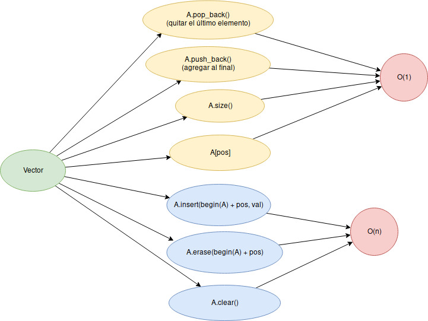

# Clase 04

## Objetivos

* Familiarizarse con la STL
* Ver problemas de fuerza bruta

# STL (Standard Template Library)


Básicamente podemos ver a la STL como una colección de estructuras de datos y funciones de uso común que
nos hará la vida mas sencilla :smile: . Esta librería en muy
amplia, pero solo requerimos una pequeña parte de ella para Programación
Competitiva y bastará con practicar regularmente con ella para poder
implementar sin problemas soluciones que se nos ocurran a los problemas.

### ¿Qué tan frecuente la usaremos?

Básicamente la usaremos siempre en nuestras soluciones :wink:

Por ejemplo, es común que las soluciones que programemos tengan que hacer un
ordenamiento como una subrutina en `O(n log n)`, para lo cual podriamos
implementar, por ejemplo, el [algoritmo de Merge Sort](https://en.wikipedia.org/wiki/Merge_sort) (probablemente estos nos tomos mas de 15 líneas de código) o podriamos usar:

```c++
std::sort() // 1 linea. O(n log n)
```

### ¿Siempre que usemos algo de la STL tendremos que usar como prefijo `std::` y declarar una a una totas las librerías que usemos?

Depende de ti. Por ejemplo, si tuvieras que leer un número `n` seguidos de `n`
números y tendrías que imprimir los números ordenamos podrías hacer una
solución así:

```c++
#include <iostream>
#include <vector>
#include <iterator>
#include <algorithm>

int main () {
  int n;
  std::cin >> n;
  std::vector <int> arr(n);
  for (int i = 0; i < n; i++) {
    std::cin >> arr[i];
  }
  std::sort(std::begin(arr), std::end(arr));
  for (int arr_i: arr) {
    std::cout << arr_i << ' ';
  }
  std::cout << std::endl;
  return (0);
}
```

O tambien podrías hacer algo como esto:

```c++
#include <bits/stdc++.h>
// Con esto nos evitamos estar incluyendo todas (para efectos de competitiva)
// las librerias que necesitemos

using namespace std;
// Cuando incluimos esto nos evitamos estar escribiendo ::std

int main () {
  int n;
  vector <int> arr(n);
  for (int i = 0; i < n; i++) {
    cin >> arr[i];
  }
  for (int arr_i: arr) {
    cout << arr[i] << ' ';
  }
  cout << endl;
  return (0);
}
```

### Ahora si, veamos algunas estructuras de datos que nos brinda la STL

### ... pero, ¿Qué es una estructura de datos :sweat_smile: ?

Es la forma como guardamos-organizamos los datos (cada estructura de datos
tiene sus ventajas y desventajas).

Comencemos con la estructura que más utilizaremos.

### Vector

Imaginemos que tenemos `n` dominos y queremos hacer una fila con ellos en
nuestra sala. Además en cada domino queremos pegar 1 papel encima donde
escribamos la posición que ocupa el domino en la fila (obviamente las
posiciones comenzaran en 0 :singlasses:) y en la cara frontal del domino escribiremos el
nombre de un Pokemón. Además, siempre estamos
ubicados al final de la fila desde un ángulo en el que podemos ver los papeles
con las posiciones de todos los dominos pero solo el nombre del último pokemon
de la fila.


Para hacer dicha tarea nos interesaria hacer las siguientes acciones:

* **Agregar un domino al final de la fila**
* **Quitar el último domino de la fila**
* **Ver que Pokemón está en alguna posicion dada**
* **Ver en que posición(es) está un Pokemón dado**
* **Agregar un domino en cualquier posición**
* **Eliminar un domino en cualquier posición**
* **Mover todos los dominos a otro lado**

Ahora, como hace poco aprendimos [Complejidades](https://en.wikipedia.org/wiki/Time_complexity)
probablemente nos interesaría (por alguna extraña razón :grimacing: ) hacer una especie de estimación de cuantas
operaciones requerien cada actividad.

* **Agregar-quitar un domino al final de la fila**

  Como siempre estamos ubicados al final de la fila y esta actividad es bien
básica. Podriamos decir que estas actividades tienen complejidad `O(1)`

* **Ver que Pokemón está en alguna posición dada**

  Como siempre podemos ver todos los papeles con las posiciones, no debería ser
difícil encontrar la posición que buscamos y mover un poco nuestro ángulo para
revisar que Pokemón esta en esa posición. Así, podriamos decir que esta
actividad es `O(1)`

* **Ver que en que posicion(es) está un Pokemón dado**

  Como no sabemos como estan distribuidos los dominos. Lo más natural sería
revisar el Pokemón escrito en cada ficha. Es decir, esto sería `O(n)`

* **Agregar-quitar un domino en cualquier posición**

  Si agregamos-quitamos un domino en una posición, tendremos que actualizar las
posiciones de todos los dominos delante de este. Ahora, en el peor de los casos
(agregar-quitar un domino al inicio) tendríamos que actualizar todas las posiciones.
Luego esta operación sería `O(n)`

* **Mover todos los dominos a otro lado**

  Si, por ejemplo, queremos mover toda la fila más a la derecha, lo más
natural y sencillo sería ir moviendo cada domino uno a uno. Así, dicha
actividad la podríamos  hacer en `O(n)`

... Y bien, básicamente un vector hace la anterior tarea donde los papeles de los
dominos con las posiciones son los índices de los elementos del vector y los
nombres de los Pokemones son los datos que guarda el vector.

En c++ la sintaxis de las anteriores acciones es así:

```c++
#include <bits/stdc++.h>

using namespace std;

int main () {
  vector <int> arr;
  // Agregar un elemento al final - O(1)
  arr.push_back(123);
  arr.push_back(987);
  arr.push_back(343);
  arr.push_back(134);
  arr.push_back(345);
  // Quitar un elemnto del final - O(1)
  arr.pop_back();
  // Agregar un elemento en la posicion `i` - O(n)
  int i = 2;
  arr.insert(begin(arr) + i, 234);
  // Eliminar un elemento de la posicion `i` - O(n)
  i = 1;
  arr.erase(begin(arr) + i);
  // Copiar el vector - O(n)
  vector <int> arrCopy = arr;
  // Para iterar el arr podemos hacerlo asi:
  for (int arr_i: arr) ;
  // O tambien asi
  // arr.size() nos retorna la cantidad de elementos - O(1)
  for (int i = 0; i < arr.size(); i++) ;
  // Si queremos eliminar todos los elementos - O(n)
  arr.clear();
  return (0);
}
```

En resumen, los métodos más frecuentes para vectores son:



### Deque

Ahora, queremos una estructura que nos permita todo lo que un vector nos ofrece y 2 operaciones más:

* Insertar un elemento al inicio en `O(1)`
* Eliminar el primer elemento en `O(1)`

Y apuesto que adivinas por el título de la sección que estructura nos permite hacer eso :smile:

```c++
// La sintaxis es la misma que la de std::vector
// Pero ahora la declaracion es asi
deque <int> arr;
// ...
// Agregar un elemento al inicio - O(1)
arr.push_front(123);
// Eliminar el primer elemento - O(1)
arr.pop_front();
```

### Algunas funciones útiles para vectores

Antes de ver dichas funciones es bueno señalar que cuando una función de la STL
require un rango como parámetros, siempre los recibe en esta forma

`[inicio, fin)`

Asi, por ejemplo, si quiero aplicar una función de la STL a los elementos de posiciones `[4, 7]` tendría que brindar los parametros:

`(begin(A) + 4, begin(A) + 8)`

Por ejemplo:
```c++
vector <int> A = {12, 43, -13, 100, 100, -10};
// Busca el maximo elemento en todo el vector
cout << *max_element(begin(A), end(A)) << endl;
// Busca el maximo elemento en [0, 2]
cout << *max_element(begin(A), begin(A) + 3) << endl;
// Algunas de las funciones de la STL nos retornan punteros a elementos
// Por ejemplo la anterior funcion nos retorna un puntero al maximo elemento
// en el rango dado. Por ello, para acceder a su valor ponemos el `*` al
// inicio de la funcion
```

Otras funciones que te pondria interesar chequear:

* [`min_element`](http://www.cplusplus.com/reference/algorithm/min_element/)
* [`minmax`](http://www.cplusplus.com/reference/algorithm/minmax/)
* [`sort`](http://www.cplusplus.com/reference/algorithm/sort/)
* [`fill`](http://www.cplusplus.com/reference/algorithm/fill/)
* [`reverse`](http://www.cplusplus.com/reference/algorithm/reverse/)
* [`random_shuffle`](http://www.cplusplus.com/reference/algorithm/random_shuffle/)
* [`unique`](http://www.cplusplus.com/reference/algorithm/unique/)
* [`count`](http://www.cplusplus.com/reference/algorithm/count/)

Sin embargo, la STL no límita esas funciones solo a los vectores. Tambien puedes aplicar a deque y en realidad a una gran clase de estructuras (como iras viendo poco a poco).

### ¿Y qué pasa si quiero guardar algo distinto a `int`s en un vector?

Solo lo declaras asi:
```c++
// vector <tipo de dato> arr;
// Por ejemplo
vector <double> arr1;
vector <long long> arr2;
vector <string> arr3;
vector <char> arr4;
// ...
```

### ¿y que hay si quiero guardar tipos de datos más complejos en un vector?

Para ello podrías usar un `struct` o una `class`. Sin embargo, aún no veremos ello. Aunque podrás encontrar un poco de ello en la bibliografía.

Es bueno añadir que comunmente necesitaras guardar pares. Para ello puedes usar un pair. Así:

```c++
// pair <tipo de dato 1, tipo de dato 2> p1;
// Por ejemplo
pair <int, int> p1;
cout << p1.first << ' ' << p1.second << endl;
pair <int, double> p2;
pair <string, long long> p3;
vector <pair <int, int>> arr;
// ...
```

### ¿Y como declaro una matrix?

Puedes hacer un vector de vectores

```c++
// Si queremos una matrix de n por m
int n = 10, m = 20;
vector <vector <int>> mat1;
for (int i = 0; i < n; i++) {
  vector <int> row;
  for (int j = 0; j < m; j++) row.push_back(0);
  mat1.push_back(row);
}
// Tambien puedes armar la matrix de n por m asi
vector <vector <int>> mat2;
for (int i = 0; i < n; i++) {
  vector <int> row(m, 0);
  mat2.push_back(row);
}
// O incluso Asi
vector <vector <int>> mat(n, vector <int> (m, 0));
```

### ¿Siempre debo usar la STL?

Usala con criterio. Si ves que solo te esta complicando la vida y hay una forma
mas sencilla (con la misma complejidad). Solo has lo que te paresca mas natural.

Por ejemplo, si quisiera rellenar toda la matrix anterior de 1s. Podría hacer esto con la STL;

```c++
fill(begin(mat1), end(mat1), [&] (vector <int>& row) {
  fill(begin(row), end(row), 1);
})
```

O simplemente algo como:

```c++
for (int i = 0; i < n; i++) for (int j = 0; j < m; j++) mat1[i][j] = 1;
```

Si quisiera imprimir los elementos de la matrix, podria hacer algo como esto con la STL:

```c++
for_each(begin(mat), end(mat), [&] (const vector <int>& row) {
  copy(begin(row), end(row), ostream_iterator <int> (cout, " "));
  cout << endl;
});
```

O simplemente algo como:

```c++
for (int i = 0; i < n; i++) {
  for (int j = 0; j < m; j++) {
    cout << mat1[i][j] << ' ';
  }
  cout << endl;
}
```

Ahora, veamos otra estructuras

### Set

Esta estructura sería el analogo en programación de lo que un conjunto es en Matemática.
Los elementos en un Set solo se consideran una vez (Por ejemplo, si ingresaramos 10 veces el numero 1 a un conjunto, este solo se consideraria una vez) y el orden de sus elementos no importa. Pues:

`{1, 2, 3} = {3, 2, 1}`

Aunque, en realidad, la implementacion de un Set en c++ internamente guarda los elementos en orden creciente por detalles internos.

Las operaciones que maneja un Set son:

* Insertar (val) en `O(log n)`
* Encontrar (val) en `O(log n)`
* Eliminar (val) en `O(log n)`
* Mostrar la cantidad de elementos () en `O(1)`

Veamos un poco la sintaxis:

```c++
set <int> S;
// Insertar un elemento - O(log n)
S.insert(3);
S.insert(4);
S.insert(-100);
S.insert(-345);
// Comprobemos que los elementos son guardados en orden ascendente
for (auto x: S) {
  cout << x << endl;
}
// Ver si un elemento pertenece al Set - O(log n)
if (S.count(4) > 0) {
  cout << "4 esta en el Set\n";
}
// Tambien podemos usar find para esto
if (S.find(4) != end(S)) {
  cout << "4 esta en el Set" << endl;
}
// Eliminar un elemento - O(log n)
S.erase(4);
// Tambien podemos eliminar así
S.erase(S.find(4));
// Si previamente guardamos
// auto it = S.find(val) - O(log n)
// Luego
// S.erase(it) - O(1)
```

En resumen de lo anterior:


# Multiset

Un multiset tiene las funcionalidades de un set, pero acepta duplicado de elementos

Enconces, ahora

```c++
multiset <int> S;
// ...
int val = 3;
S.count(val); // Retornara cuantas veces `val` esta en el Multiset
// ...
S.erase(val); // Eliminara todas las ocurriencias de `val` en el Multiset
// ...
S.erase(S.find(val)); // Eliminara una ocurrencia de `val` del Multiset
```

### Map

Asi como un Set era una especie se analógo de lo que es un conjunto en Matemática para Computación. Un Map sería el análgo de lo que es una función en Matemática para Computación.

Es decir. Un Map nos permite asociar tipos de datos.

`Map <tipo 1, tipo2> mp;`

Analogo a una función en Matemática (donde `f(x) = y` quiere decir que no existe un `y2` distinto de `y` tal que `f(x) = y2`)

Un Map solo tiene un valor asociado para un valor de `tipo 1` (llamaremos `clave` o `key` a este). Es decir, un Map no tiene `Key`s iguales con distintos valores asociados.

Por ejemplo:

```c++
map <string, long long> mp1;
mp1["jose"] = 1000000;
mp1["leonidas"] = 42;
map <string, string> mp2;
mp2["hola"] = "mundo";
map <string, vector <string>> mp3;
map <pair <int, int>, int> mp4;
map <int, set <int>> mp5;
// ...
// Un Map tiene los mismos metodos de un Set y en al misma complejidad
 ```

### Multi Map

Similar al Multiset, un Multi Map es un Map que puede tener `Key`s iguales con distintos valores asociados.

Sim embargo, esta estructura casi no es utilizada en Competitiva :no_mouth: .

### ¿Que más debería aprender de la STL?

Te ayudará aprender (iremos viendo poco a poco eso)

* [`stack`](http://www.cplusplus.com/reference/stack/stack/)
* [`queue`](http://www.cplusplus.com/reference/queue/queue/)
* [`priority_queue`](http://www.cplusplus.com/reference/queue/priority_queue/)
* [`unordered_set`](http://www.cplusplus.com/reference/unordered_set/)
* [`unordered_map`](http://www.cplusplus.com/reference/unordered_map/)
* [`bitset`](http://www.cplusplus.com/reference/bitset/bitset/)
* [`list`](http://www.cplusplus.com/reference/list/)
* [`string streams`](http://www.cplusplus.com/reference/sstream/stringstream/)
* [`getline`](http://www.cplusplus.com/reference/string/string/getline/)


Tambien te puede set util revisar funciones como `pow`, `sqrt`, `cbrt`,
`hypot`, `sin`, `cos`, `tan`, `asin`, ...

Es bueno añadir que estas funciones retornan un `double`

Si deseas obtener más precisión puedes una l al final (e.g `powl`, `sqrtl`,
..., `sinl`, ..., `asinl`) y obtener un `long double`


### Para ver más del tema puedes chequear

Practicar bastante y leer blogs como estos:

* [Topcoder](https://www.topcoder.com/community/competitive-programming/tutorials/power-up-c-with-the-standard-template-library-part-1/)
* [cplusplus](http://www.cplusplus.com/reference/vector/vector/)
* [Competitive C++ Manifesto: A Style Guide](https://codeforces.com/blog/entry/64218)


## Ahora, veamos 2 problemas de fuerza bruta

Chequiemos estos 2 problemas por unos minutos e intentemos resolverlos.

* [A. Cut Ribbon](https://codeforces.com/problemset/problem/189/A)
* [A. 2Char](https://codeforces.com/contest/593/problem/A)

*La solucion se dara en la pizarra o en el proyector pasado unos minutos*

* [Notas de Mini de fuerza bruta (en desarrollo)](https://gist.github.com/miguelAlessandro/f588d159a768dc43cc1ec9b81b27bd57)

## ¿Y qué puedo hacer con mi vida hasta la próximo clase?

[Contest time :smile:](https://vjudge.net/contest/279950)
*password*: pcuni
